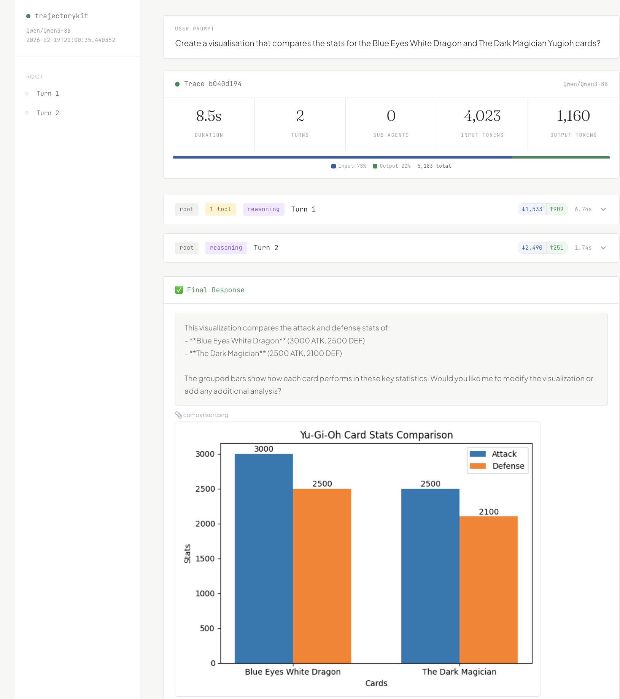
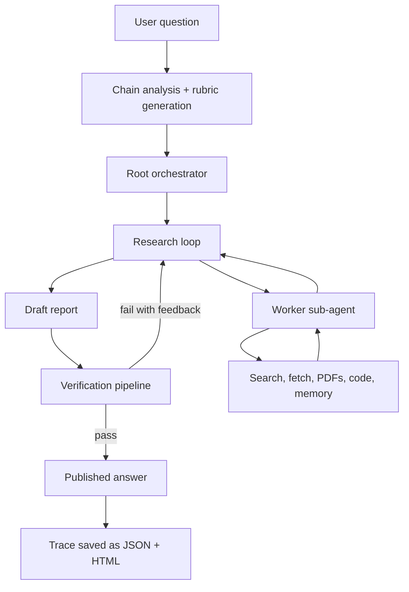
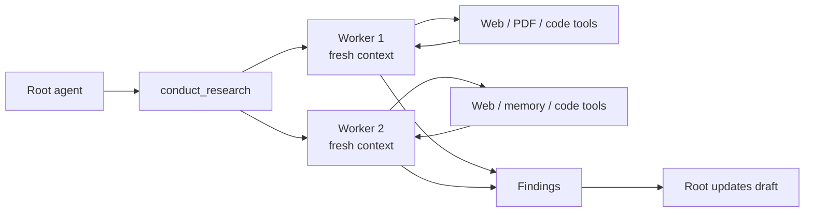
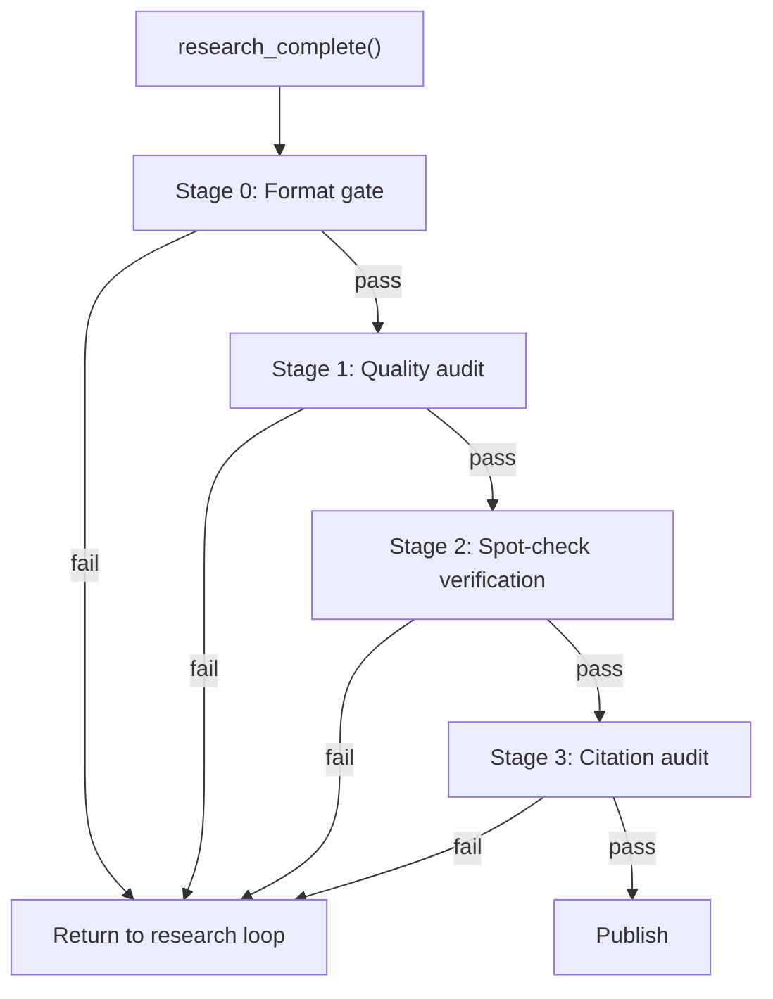
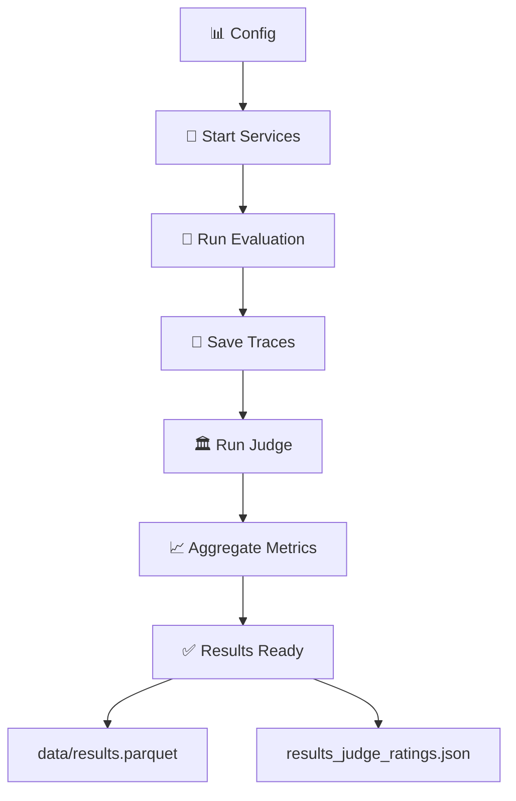

# 🤖 TrajectoryKit

> A **minimal deep research agent harness** for running LLM agents with recursive sub-agents, sandboxed code execution, and full execution tracing — all from a single YAML config. Built on GPT-OSS-20B with GPT-5.4 as an optional refinement layer.

[](LICENSE)
[](https://www.python.org/downloads/)

---

## Why TrajectoryKit?

Most agent frameworks are cloud-first and opaque. TrajectoryKit is designed for researchers who want full control:

- **Minimal-model design.** Achieve PhD-level research quality with an open-weight 20B model (GPT-OSS-20B). Use GPT-5.4 only as an optional post-processing refinement layer, not the primary research engine. This approach cuts inference costs while maintaining competitive quality across 22 research domains.
- **One config, one command.** Write a single YAML file that specifies your model, GPU devices, vLLM configuration, sandbox, dataset, and optional judge. Then just run `orchestrate.py` — it handles everything: pulling container images, launching services, running evaluation, and grading output.
- **Recursive delegation that actually works.** Sub-agents run in isolated contexts with their own tools and traces, so they never pollute the parent's memory. Each one maintains its own research trajectory.
- **Memory that doesn't blow up your context window.** Tool outputs get stored externally and accessed on-demand via code execution, which is way more efficient than dumping everything into attention. The LLM can write programs to search its own research history.
- **Every turn is recorded.** Full execution trees with turn-by-turn details, all tool calls, sub-agent cascades, token usage, and wall-clock latency get saved as JSON and rendered as an interactive HTML trace you can click through.

---

## Quickstart

Get up and running in three commands:

```bash
# 1. Set up the environment
conda env create -f environment.yml
conda activate pika
pip install -e .

# 2. Run a full experiment (this launches sandbox + vLLM + eval + judge grading)
python orchestrate.py --config configs/experiments/gpt_oss_deepsearchqa.yaml
```

Or if you want more control, start the services separately:

```bash
# Start services in the background
python orchestrate.py --config configs/experiments/gpt_oss_deepsearchqa.yaml --services-only

# Then run eval and judge independently
python evals/eval.py --config configs/experiments/gpt_oss_deepsearchqa.yaml
```

### Programmatic use

You can also import and use the agent directly in Python:

```python
from trajectorykit import dispatch

result = dispatch(
    user_input="Compare the populations of Tokyo and New York City",
    turn_length=10,
    verbose=True,
)

print(result["final_response"])
result["trace"].save()  # Saves to traces/trace_YYYYMMDD_HHMMSS_uuid.json + .html
```

<p align="center">
  
</p>

### Live Demo

[**Click here to see a real agent trace in action.**](https://kabakawilliam.github.io/trajectorykit/demo_trace.html) The HTML viewer lets you step through the timeline: watch the agent searching the web, reading pages, running code in a sandbox, and synthesizing answers across 15+ turns.

---

## 🏆 Evaluation Results

TrajectoryKit is rigorously evaluated on **[Deep Research Bench](https://github.com/Ayanami0730/deep_research_bench)**, a benchmark with 100 PhD-level research tasks across 22 domains. The primary research engine uses **GPT-OSS-20B** (open-weight, locally deployed), with optional GPT-5.4 refinement:

| Metric | Baseline (GPT-OSS-20B) | With Rewrite (+GPT4.5 refiner) | Improvement |
|--------|----------|--------------|-------------|
| Comprehensiveness | 0.4548 | **0.5260** | +15.7% |
| Insight/Depth | 0.4397 | **0.5701** | **+29.7%** ⭐ |
| Instruction Following | 0.5071 | **0.5260** | +3.7% |
| Readability | 0.4899 | **0.5247** | +7.1% |
| **Overall Score** | 0.4696 | **0.5407** | **+15.1%** |

**Key insight:** The baseline (GPT-OSS-20B alone) reaches 0.4696 on Deep Research Bench before any rewrite step, showing that much of the performance comes from the harness rather than a large multi-model stack.

### Impact of Reasoning Effort

The framework supports different reasoning effort levels. Here's how reasoning effort affects performance on Deep Research Bench:

| Reasoning Effort | Comprehensiveness | Insight | Instruction Following | Readability | Overall |
|------------------|-------------------|---------|----------------------|-------------|---------|
| LOW | 0.5199 | 0.5636 | 0.5223 | 0.5247 | 0.5360 |
| MEDIUM | 0.5183 | 0.5645 | 0.5239 | 0.5237 | 0.5361 |
| HIGH | 0.5260 | 0.5701 | 0.5260 | 0.5247 | **0.5407** |


---

## Agent Overview

### Complete Workflow


### Overall Harness

TrajectoryKit separates planning, research, drafting, and verification into distinct stages. The root orchestrator can recursively delegate research to fresh-context worker agents, then consolidate their findings into a draft before publishing only after verification passes.



#### Recursive Delegation


#### Verification Pipeline


**Deep Research Bench Configuration Note:** The diagram above reflects the production setup for evaluating on Deep Research Bench. Chain analysis and rubric generation use GPT-5.4 (external) to design high-quality evaluation criteria before research begins. The research loop itself runs on gpt-oss-20b (local) for efficiency. Quality auditing (Stage 1) uses GPT-5.4 (external) with the rubric to guide depth assessment, while spot-check verification and citation audit use local models to minimize cost at scale.

### Key design decisions

| Concern | Approach |
|---------|----------|
| Model flexibility | In bench mode (Deep Research), specific models are assigned: chain analysis and rubric generation use external GPT-5.4, research loop uses local gpt-oss-20b, Stage 1 quality audit uses external GPT-5.4, and Stages 2–3 use local models. In general mode, most LLM steps accept either external or local as drop-in replacements via `verifier.stage1_provider` and `verifier.stage2_provider` config. Configure via `model.name`, `model.api_url`, and verifier block. |
| Causal chains | Before dispatch, the LLM reads your question and detects multi-step dependencies. We build a `ChainPlan` that enforces sequential execution — if a step depends on an earlier result, we block it until that result exists. |
| Verification | Five-stage pipeline (rubric generation + 4-stage verification): First, create a rubric defining sub-questions, coverage checklist, source requirements, hallucination traps, and insight bar. Then after publishing: format gate → Stage 1 quality audit (8 criteria: adequacy, language consistency, depth, comprehensiveness, section quality, citations, coherence, conflicts/gaps) → Stage 2 spot-check (extract claims with external model, verify with local sub-agents in parallel, compare with local judge) → Stage 3 citation audit (verify URLs support claims). Fail paths loop back with rubric feedback. |
| Cycle prevention | Five safety gates prevent infinite loops: can't publish without a draft, can't republish without revising, can't draft without researching, must follow the plan once it's active, and in report mode can't publish without a second research phase after the first draft. |
| Context management | When the conversation gets long, we automatically trim old messages but keep the system prompt and recent turns. Tool outputs get stashed in an external `MemoryStore`, and synthesis sub-agents can query them by running code. No context is ever wasted. |
| Search resilience | Three-tier fallback for search: try Serper first, then Exa.ai if Serper fails (better for neural queries), then DuckDuckGo as the last resort. Each tier handles credit exhaustion, auth failures, and rate limits gracefully. |
| Fetch resilience | Four-tier fallback for fetching URLs: direct HTTP, then Jina Reader for JS-heavy sites, then Exa's content API, then Wayback Machine for archived versions. |
| Draft workflow | The root agent writes drafts using the `refine_draft` tool and publishes via `research_complete`. We keep all draft versions, and the verifier gives feedback if your answer lacks depth or insight. |
| Budget management | As you approach the turn limit, we send informal warnings at 5, 3, 2, and 1 turns remaining. On the final turn, the agent can only use `final_answer` to wrap things up. |
| Trace fidelity | Every turn is fully recorded: what the LLM said, which tools it called and with what arguments, the results, wall-clock duration, any child traces from sub-agents, and token usage. |

---

## Experiment Configs

Define everything in one YAML file. Here's an example:

```yaml
# configs/experiments/gpt_oss_deepsearchqa.yaml

model:
  name: "openai/gpt-oss-20b"
  api_url: "http://localhost:3030/v1"

vllm:
  port: 3030
  gpu_devices: [2]
  gpu_memory_utilization: 0.9
  tool_call_parser: "openai"
  reasoning_parser: null
  extra_args: ["--async-scheduling"]
  env:
    TIKTOKEN_CACHE_DIR: "/VData/resources/huggingface/tiktoken-cache"

sandbox:
  url: "http://localhost:8080/run_code"
  port: 8080
  sif_image: "sandbox-fusion_server-20250609.sif"
  docker_uri: "docker://volcengine/sandbox-fusion:server-20250609"

agent:
  max_recursion_depth: 1
  sub_agent_turn_budget: 10

dataset:
  name: "google/deepsearchqa"
  split: "eval"
  sample_n: 100
  seed: 42

eval:
  turn_length: null          # unlimited
  reasoning_effort: "high"

judge:
  enabled: true
  model: "gpt-4.1-mini"
  threads: 5
```

Then just run:

```bash
python orchestrate.py --config configs/experiments/gpt_oss_deepsearchqa.yaml
```

The orchestrator does the heavy lifting:

1. Pulls container images from Apptainer and starts the sandbox
2. Launches vLLM with your model, GPU setup, and parser configuration
3. Waits for services to be healthy
4. Runs evaluation on your dataset
5. Grades results with the LLM judge (if enabled)
6. Leaves services running so you can iterate

Results are saved to `data/` as parquet files with per-item and aggregate metrics.

---

## Running Evaluations

### Quick Start: One Command

```bash
# End-to-end: services → eval → judge → scoring
python orchestrate.py --config configs/experiments/gpt_oss_deepsearchqa.yaml
```

### Available Benchmark Configurations

| Benchmark | Config | Model | Dataset |
|-----------|--------|-------|---------|
| **DeepSearchQA** | `gpt_oss_deepsearchqa.yaml` | GPT-OSS-20B | Google DeepSearchQA (~100 samples) |
| **Deep Research Bench** | `gpt_oss_deep_research_bench.yaml` | GPT-OSS-20B | Deep Research Bench (100 PhD-level tasks, 22 domains) |
| **Alternative: Qwen** | `qwen3_deepsearchqa.yaml` | Qwen3-8B | Google DeepSearchQA |

**Model Flexibility:** All configs default to minimal-model approaches (20B or 8B open-weight). You can swap in heavier models (e.g., GPT-4.5, Claude-3) by modifying the `model.name` and `model.api_url` fields in any config.

<p align="center">
  <strong>Get results in minutes:</strong> Choose a config above and run <code>python orchestrate.py --config ...</code>
</p>

### Evaluation Pipeline



### Standalone Usage

For more control, run evaluation components separately:

```bash
# Just eval (no judge)
python evals/eval.py --config configs/experiments/gpt_oss_deepsearchqa.yaml

# Just judge (on existing results)
python evals/llm_judge.py --results data/google_deepsearchqa/gpt_oss_20b/results.parquet

# Recover parquet from trace JSONs (if eval crashed mid-run)
python evals/recover_parquet.py
```

### Evaluation Output

- `results.parquet` — Per-item metrics, token counts, latency
- `results_judge_ratings.json` — Judge scores with per-metric breakdowns
- `traces/` — Full JSON + HTML traces for each query

---

## Project Structure

```
trajectorykit/
├── orchestrate.py                    # One-command experiment runner
├── serve_vllm_oss.sh                 # Manual vLLM launch script
├── environment.yml                   # Conda environment
├── pyproject.toml                    # Package metadata
│
├── configs/
│   ├── default.yaml                  # Fallback config
│   ├── experiments/
│   │   ├── gpt_oss_deepsearchqa.yaml          # GPT-OSS-20B on DeepSearchQA
│   │   ├── gpt_oss_deep_research_bench.yaml   # GPT-OSS-20B on Deep Research Bench
│   │   └── qwen3_deepsearchqa.yaml            # Qwen3-8B on DeepSearchQA
│   └── prompts/
│       ├── orchestrator.txt          # Root agent system prompt
│       ├── orchestrator_bench.txt    # Bench-mode orchestrator (report format)
│       ├── worker.txt                # Sub-agent system prompt
│       ├── synthesizer.txt           # Synthesis sub-agent prompt
│       ├── chain_analysis.txt        # Chain detection prompt
│       ├── verifier.txt              # Stage 1 verification prompt
│       ├── verifier_bench.txt        # Bench-mode verifier (insight criterion)
│       ├── spotcheck_extract.txt     # Stage 2 — claim extraction
│       ├── spotcheck_compare.txt     # Stage 2 — evidence comparison
│       ├── spotcheck_compare_bench.txt # Bench-mode spot-check compare
│       ├── spotcheck_refusal.txt     # Stage 2 — refusal challenge
│       └── citation_audit.txt        # Stage 3 — citation faithfulness
│
├── src/trajectorykit/
│   ├── __init__.py                   # Public API (dispatch, EpisodeTrace, render_trace_html)
│   ├── agent.py                      # Entry point: dispatch() + chain analysis
│   ├── agent_state.py                # AgentState dataclass + create_state()
│   ├── runner.py                     # Turn loop, 5 cycle gates, history compaction
│   ├── nodes.py                      # Tool handlers + 4-stage verification pipeline
│   ├── chain.py                      # Causal chain analysis (ChainPlan/ChainStep)
│   ├── plan.py                       # ResearchPlan + PlanTask tracking
│   ├── config.py                     # YAML config loader + 30+ configurable keys
│   ├── tool_store.py                 # Tool definitions (4,200+ lines)
│   ├── tracing.py                    # Trace dataclasses + HTML renderer
│   ├── memory.py                     # MemoryStore (compressed tool output storage)
│   ├── symbolic.py                   # Symbolic reference compression
│   ├── utils.py                      # Shared utilities
│   └── apptainer.sh                  # Sandbox container pull + run
│
├── deep_research_bench/              # 📊 Evaluation Benchmark
│   ├── README.md                     # Benchmark setup, results, and evaluation framework
│   ├── deepresearch_bench_race.py    # RACE (Reference-based Adaptive Criteria) evaluator
│   ├── rewrite_articles.py           # ✨ Post-processing rewrite with GPT-5.4/Claude
│   ├── run_benchmark.sh              # End-to-end benchmark runner
│   ├── data/
│   │   ├── deep_research_bench/      # 100 benchmark queries (22 domains)
│   │   ├── test_data/                # Agent outputs (JSONL format)
│   │   └── criteria_data/            # Evaluation rubrics
│   ├── results/race/                 # RACE eval results per model
│   └── results/fact/                 # FACT eval results per model
│
├── evals/
│   ├── eval.py                       # DeepSearchQA evaluation runner
│   ├── eval_deep_research_bench.py   # Deep Research Bench eval (RACE + FACT)
│   ├── llm_judge.py                  # LLM-as-judge grading
│   ├── recover_parquet.py            # Rebuild results from trace JSONs
│   └── traces_to_parquet.py          # Convert trace JSONs → parquet
│
├── data/                             # Evaluation outputs (parquets, traces)
├── traces/                           # Ad-hoc trace storage
└── docs/                             # Screenshots and diagrams
```

---

## Tools

### Root tools (orchestrator only)

These tools are available only to the root orchestrator agent:

| Tool | What it does |
|------|----------|
| `conduct_research` | Spawn a sub-agent to research a specific topic. The sub-agent gets its own context, tools, and trace. |
| `refine_draft` | Write or completely replace the draft report. Each call overwrites the previous version. |
| `read_draft` | Look back at previous draft versions and any feedback the verifier left. |
| `research_complete` | Publish the draft and trigger the 4-stage verification pipeline. |
| `summarize_webpage` | Fetch a URL and get an LLM-generated summary focused on a topic. Faster than spawning a sub-agent for quick reads. |
| `think` | Reasoning scratchpad — the LLM can think out loud here without showing it to the user. |
| `search_available_tools` | Self-introspection. List all tools or get the full schema for a specific one. |

### Worker tools (sub-agents)

Sub-agents have access to these tools for research and fact-checking:

| Tool | What it does |
|------|-------------|
| `search_web` | Search the web with automatic fallback: Serper → Exa.ai → DuckDuckGo. Handles credit exhaustion gracefully. |
| `fetch_url` | Fetch a page with four-tier resilience: direct HTTP → Jina Reader → Exa contents → Wayback Machine. Supports `css_selector` for targeted extraction and `extract="table"` mode for structured data. |
| `read_page` | Scroll through cached page text from a previous `fetch_url` call — no new network requests. |
| `extract_tables` | Parse HTML tables from a URL and return them as structured JSON (array of dictionaries). |
| `read_pdf` | Download and extract text from a PDF. |
| `wikipedia_lookup` | Look up a Wikipedia article via the MediaWiki API. Returns the article text, section list, and structured infobox data. |
| `fetch_cached` | Retrieve an archived version of a URL from the Wayback Machine. |
| `execute_code` | Run code in a sandboxed environment (Python plus 40 other languages). Supports base64 file upload and download. |
| `recall_memory` | Retrieve previously stored tool outputs by key. Query across the compressed memory for specific data. |
| `spawn_agent` | Recursively spawn a sub-agent with fresh context and its own trace. |
| `final_answer` | Submit the final answer and terminate the loop. |
| `think` | Reasoning scratchpad for internal deliberation. |

---

## Tracing

Every `dispatch()` call produces a complete execution trace with every turn, tool call, and decision recorded.

### Terminal output

Get a quick summary in your terminal:

```python
result["trace"].pretty_print()
```

Output:

```
🏁 Agent [root]  trace_id=a3f7c912
  Input: What country has the largest population in Africa?
  Duration: 22.14s | Turns: 3 | Tool calls: 4
━━━━━━━━━━━━━━━━━━━━━━━━━━━━━━━━━━━━━━━━
  ┌─ Turn 1 (6.21s)
  │  🔧 search_web({"query": "largest population Africa"}) [1.03s]
  │     → 1. Nigeria — 223.8 million (2024) ...
  │  🔧 wikipedia_lookup({"title": "Nigeria", "section": "Demographics"}) [0.84s]
  │     → Population: 223,804,632 (2024 estimate) ...
  └─
  ┌─ Turn 2 (4.12s)
  │  🔧 extract_tables({"url": "https://en.wikipedia.org/wiki/..."}) [1.22s]
  │     → [{"Country": "Nigeria", "Population": "223804632", ...}, ...]
  └─
  ┌─ Turn 3 (3.80s)
  │  🔧 final_answer({"answer": "Nigeria, with ~224 million people"}) [0.00s]
  └─
📊 Episode Summary:
  Prompt tokens:       12,450
  Completion tokens:    1,820
  Total tokens:        14,270
```

### JSON + HTML

Save the full trace as self-contained JSON and HTML:

```python
result["trace"].save()
# → traces/trace_20260219_210429_154b9f2e.json
# → traces/trace_20260219_210429_154b9f2e.html
```

The HTML viewer is fully interactive: collapse and expand turns, view reasoning content, inspect tool calls and their arguments, see inline images (stored as base64), and check token counts and latency per turn.

---

## Configuration

Settings are loaded from a YAML config file with a fallback chain: explicit path → `TRAJECTORYKIT_CONFIG` environment variable → `configs/default.yaml` → built-in defaults.

### Key config sections

| Section | Purpose |
|---------|---------|
| `model` | Which model to use and where to find it (name and API URL) |
| `vllm` | Server port, which GPUs to use, memory utilization, parser type, extra launch flags |
| `sandbox` | Sandbox service URL, port, container image, Docker URI |
| `agent` | Max recursion depth, sub-agent turn budget, verification settings, context compaction rules |
| `model_profiles` | Per-model overrides: context window, temperature, reasoning effort |
| `prompts` | Paths to system prompt files (orchestrator, worker, synthesizer, etc.) |
| `dataset` | HuggingFace dataset source, split, sample count, random seed |
| `eval` | Turn limit, reasoning effort, verbosity |
| `judge` | Whether to run grading, which judge model, how many threads |

### Environment variables

You need to set a few API keys depending on which features you're using:

| Variable | What it's for |
|----------|---------|
| `SERPER_API_KEY` | Primary web search provider (Serper.dev). Falls back to Exa or DuckDuckGo if not set or credits run out. |
| `EXA_API_KEY` | Exa.ai for neural search (fallback) and content fetching. Highly recommended. |
| `JINA_API_KEY` | Jina Reader for fetching JavaScript-heavy or paywalled pages. Optional but improves success rates. |
| `OPENAI_API_KEY` | OpenAI API key for rubric creation and post-processing rewrite (GPT-5.4). Only needed for those features. |
| `ANTHROPIC_API_KEY` | Anthropic API key for alternative post-processing rewrite (Claude Opus). Optional. |
| `SERP_API_KEY` | Legacy SerpAPI key (alternative search backend, requires setting `SEARCH_BACKEND=serpapi`). |
| `GOOGLE_API_KEY` | Gemini API key. Only needed if you're using Gemini as the judge model. |

#### Setting up your `.env` file

Create a `.env` file in the **project root** with your API keys:

```bash
# .env (at root of trajectorykit/)
SERPER_API_KEY=your_serper_key
EXA_API_KEY=your_exa_key
JINA_API_KEY=your_jina_key
OPENAI_API_KEY=your_openai_key
ANTHROPIC_API_KEY=your_anthropic_key
```

The framework automatically loads these when you run `orchestrate.py` or call `dispatch()`.

---

## Codebase map

```
┌──────────────────────────────────────────────────────────┐
│  orchestrate.py                                          │
│  Reads YAML → starts Apptainer sandbox → starts vLLM    │
│  → runs eval → runs LLM judge / RACE scorer             │
└──────────────┬───────────────────────────────────────────┘
               │
               ▼
┌──────────────────────────────────────────────────────────┐
│  agent.py → agent_state.py → runner.py → nodes.py       │
│                                                          │
│  agent.py:       dispatch() entry, config_path reload,   │
│                  pre-dispatch chain analysis (chain.py)   │
│  agent_state.py: AgentState dataclass + create_state()   │
│  runner.py:      turn loop, 5 cycle gates, plan inject,  │
│                  history compaction, synthesis pipeline   │
│  nodes.py:       tool handlers, 4-stage verification     │
│  plan.py:        ResearchPlan + PlanTask tracking         │
│  config.py:      YAML loader, prompt loader, 30+ keys    │
│                                                          │
│  Depth 0 (root):  orchestrator prompt, root tools        │
│  Depth 1+ (sub):  worker prompt, worker tools            │
│  Synthesis:       synthesizer prompt, code + final_answer│
└──────────────┬───────────────────────────────────────────┘
               │
               ▼
┌──────────────────────────────────────────────────────────┐
│  tool_store.py  (4,200+ lines)                           │
│                                                          │
│  ROOT TOOLS (orchestrator only):                         │
│  conduct_research  Delegate task → sub-agent             │
│  refine_draft      Write/replace the full draft report   │
│  read_draft        Read previous draft versions/feedback │
│  research_complete Publish draft (triggers verification) │
│  summarize_webpage Fetch URL + LLM-focused summary       │
│  think             Reasoning scratchpad                  │
│                                                          │
│  WORKER TOOLS (sub-agents):                              │
│  search_web        Serper → Exa → DuckDuckGo fallback   │
│  fetch_url         Direct → Jina → Exa → Wayback chain  │
│  read_page         Paginate cached page text (no I/O)    │
│  extract_tables    HTML tables → structured JSON         │
│  read_pdf          PDF download + text extraction        │
│  wikipedia_lookup  MediaWiki API → article/section/info  │
│  fetch_cached      Wayback Machine archived pages        │
│  execute_code      Sandboxed execution via Apptainer     │
│  recall_memory     Retrieve stored tool outputs by key   │
│  spawn_agent       Recursive sub-agent (fresh context)   │
│  final_answer      Terminates the agent loop             │
│  think             Reasoning scratchpad                  │
│  search_available_tools  Self-introspection              │
└──────────────────────────────────────────────────────────┘
```

## `dispatch()` API

Call the agent directly from Python:

```python
from trajectorykit import dispatch

result = dispatch(
    user_input="Your task here",
    turn_length=10,           # Max turns (None = unlimited)
    verbose=True,             # Print turn-by-turn output during execution
    temperature=0.7,          # Sampling temperature
    model="openai/gpt-oss-20b",
    reasoning_effort="high",  # For models that support it
    example_id="q0042",       # Optional ID for trace records
    config_path="configs/experiments/gpt_oss_deep_research_bench.yaml",  # Optional override
)

result["final_response"]   # str — the agent's final answer
result["turns"]            # int — how many turns it took
result["tool_calls"]       # int — total tools invoked
result["messages"]         # list — full conversation history
result["trace"]            # EpisodeTrace — complete execution tree
```


---

## Citation

```bibtex
@software{trajectorykit2026,
  title={TrajectoryKit: A Local-First Agentic Framework},
  author={Lugoloobi, William},
  year={2026},
  url={https://github.com/KabakaWilliam/TrajectoryKit}
}
```

## License

MIT
<!-- currently on gpt high redo -->